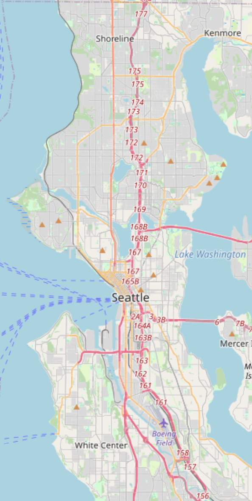
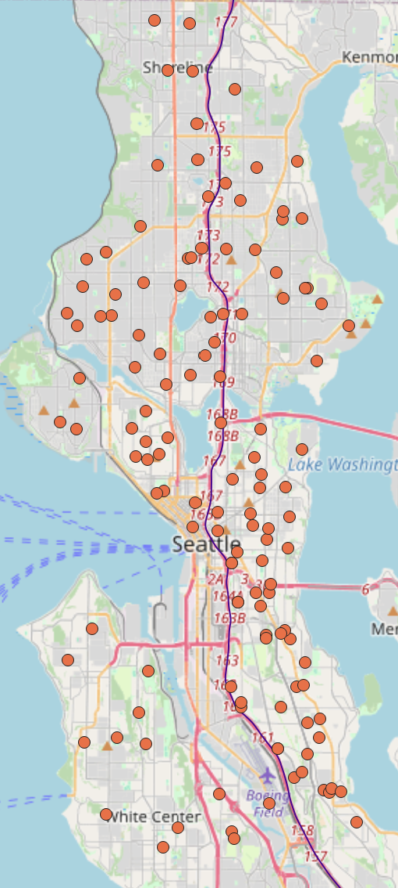
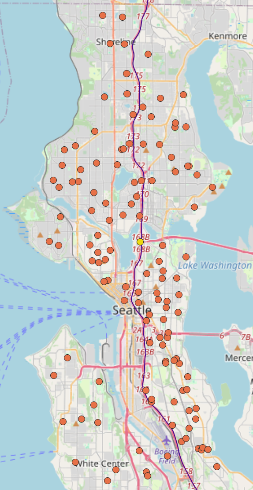

# School Proximity to I-5 In Seattle

## Macklin Farrell
### Geog458 
### 2/4/26

# Webmap
[You can access the map here](https://macklin-farrell.github.io/i5schools/)

The area of focus for this map is the city of Seattle, specifically the area around Interstate 5.

## Screenshots

**Tileset 1**

**Tileset 2**

**Tileset 3**

**Tileset 4**

### Available Zoom Levels 
Tileset 1 
Minimum Zoom: 11
Maximum Zoom: 15

Tileset 2
Minimum Zoom: 11
Maximum Zoom: 15

Tileset 3
Minimum Zoom: 11
Maximum Zoom: 15

Tileset 4 
Minimum Zoom: 11
Maximum Zoom: 15

Descriptions:
Tileset 1 is a basemap layer. 
Tileset 2 is the features highlighted for focus. I-5 and the schools in Seattle. 
Tileset 3 is a combination of the baselayer and highlighted features from tileset 2. 

Tileset 4 is schools considered to be at higher risk for exposure to particulate from I-5, within 150 meters.
